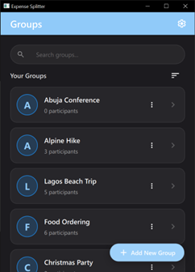
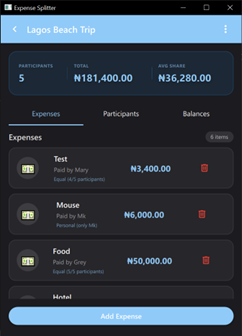
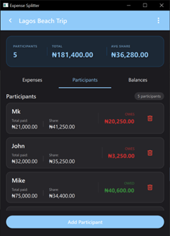
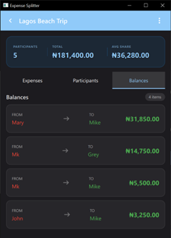
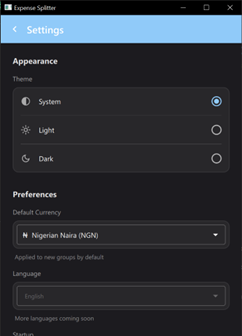
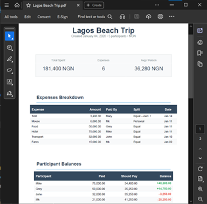

# Bells University Expense Splitter

**A fully offline desktop application for splitting group expenses** — built for students, roommates, travelers, and friends who want fair cost sharing without internet or accounts.

Developed by 300-level Computer Science students at **Bells University of Technology** as part of the Python Programming (BUT-ICT323) course (January 2026).

[](https://www.python.org/)
[](https://doc.qt.io/qtforpython/)
[](https://doc.qt.io/qt-6/qmlreference.html)
[](https://www.sqlite.org/)
[](https://opensource.org/licenses/MIT)

## 📸 Screenshots

| Main Trip List                                    | Trip Details (Expenses Tab)                   | Participants & Balances                               |
| ------------------------------------------------- | --------------------------------------------- | ----------------------------------------------------- |
|  |  |  |

| Settlement Suggestions                      | Settings (Themes & Currency)          | PDF Export Example                  |
| ------------------------------------------- | ------------------------------------- | ----------------------------------- |
|  |  |  |

_(Light and Dark themes supported — see more in the report)_

## ✨ Features

- **Fully offline** — no internet or accounts required (ideal for road trips, campus events, poor-network areas)
- Modern mobile-inspired GUI using **PySide6 + QML** (cards, tabs, floating action button, search/sort)
- Local **SQLite** database for persistent trips, participants, and expenses
- Real-time balance updates and **optimal settlement suggestions** (minimal number of payments via greedy algorithm)
- Support for equal splits + personal expenses + exclusions
- Light / Dark / System themes
- Currency selection
- Export summaries as **PDF** (via ReportLab)
- Cross-platform desktop (Windows, macOS, Linux — via PySide deploy tools)

## 🚀 Installation & Setup

### Prerequisites

- Python 3.12 or higher
- Git (to clone the repo)

### Steps

1. Clone the repository:

   ```bash
   git clone https://github.com/Mk9397/Expense-Splitter.git
   cd Expense-Splitter
   ```

2. (Recommended) Create a virtual environment:

   ```bash
   python -m venv venv

   # Windows
   venv\Scripts\activate

   # macOS/Linux
   source venv/bin/activate
   ```

3. Install dependencies:

   ```bash
   pip install -r requirements.txt
   ```

   **Note:** This includes PySide6, ReportLab, and any other packages used.

4. Run the application:

   ```bash
   python main.py
   ```

   The app should launch with the main trip list screen.

### Building a Standalone Executable (Optional)

Use the included pysidedeploy.spec with PySide6's deployment tool:

```bash
pyside6-deploy pysidedeploy.spec
```

This creates a distributable folder or .exe (depending on your platform).

## 🛠️ Tech Stack

- Backend / Logic: Python 3.12+
- GUI: PySide6 (Qt for Python) + QML
- Database: SQLite (via QtSql)
- PDF Generation: ReportLab
- Version Control: Git + GitHub
- Deployment: PySide6 deploy tools

## 📄 Full Project Report

Detailed documentation including:

- Problem statement & objectives
- Literature review
- Methodology & architecture
- Algorithm explanations
- Code snippets
- User testing results
- Challenges & future improvements

[→ Read the full report (PDF)](report.pdf)

## ⚖️ License

This project is licensed under the MIT License — see the LICENSE file for details.

## 🙌 Acknowledgments

- Team: Muktar Ayinde (Python Developer), Ayoade Abdulfattah (Product Design), Bakare Chukwuemeka, Goodluck Williams, Friday Ekeminiabasi
- Supervisor: Ayuba Muhammad
- Inspiration: Splitwise, Tricount, Settle Up — but fully offline and desktop-native

## 📬 Contributing

Contributions, bug reports, and feature suggestions are welcome!  
Feel free to open an issue or pull request.
